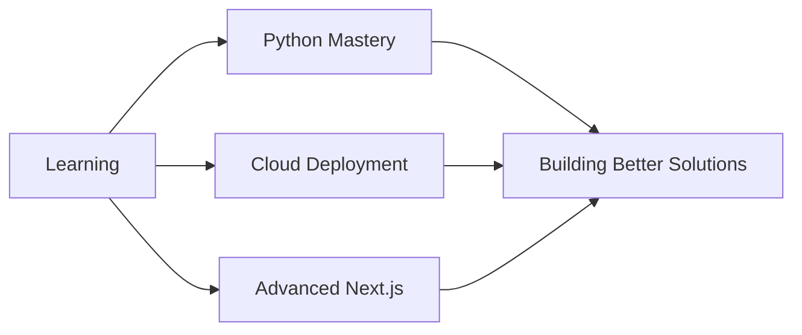

<div align="center">

# 👋 Hey there! I'm Qureshi Mohammed Hassan

### 🚀 Full-Stack Developer | MERN Enthusiast | Fragrance Brand Founder


</div>

---

## 🎯 About Me

I'm a passionate developer who thrives on turning ideas into reality through clean code and intuitive design. My journey spans from crafting scalable web applications with modern technologies to building **Lelido** — a unique fragrance brand that bridges my creative and technical worlds.

```javascript
const hassan = {
    location: "Building digital experiences worldwide",
    currentFocus: ["Next.js", "React", "Node.js", "Python", "Cloud Deployment"],
    passion: "Bridging creativity and code",
    brand: "Lelido Fragrances",
    mindset: "Always learning, always creating"
};
```

---

## 💡 What I Bring to the Table

<table>
  <tr>
    <td align="center" width="33%">
      
      <h3>Web Development</h3>
      <p>Full-stack mastery with MERN stack, crafting clean UI/UX experiences</p>
    </td>
    <td align="center" width="33%">
      
      <h3>End-to-End Solutions</h3>
      <p>From initial concept to production deployment and beyond</p>
    </td>
    <td align="center" width="33%">
      
      <h3>Brand Building</h3>
      <p>Merging entrepreneurial vision with technical expertise</p>
    </td>
  </tr>
</table>

---

## 🌐 Let's Connect

<div align="center">

[](https://linkedin.com/in/your-link)
[](mailto:qureshihassan45@gmail.com)
[](#)

</div>

---

## 💻 Tech Stack & Tools

<div align="center">

### 🎨 Frontend Development


### ⚙️ Backend Development


### 🗄️ Databases


### 📱 Mobile & Other Languages


</div>

---

## 📊 GitHub Analytics

<div align="center">
  


</div>

---

## 🎯 Current Focus



---

## 📈 Contribution Graph

<div align="center">
  


</div>

---

<div align="center">

### 💭 Dev Quote of the Day


### 🎯 Profile Views
[](https://visitcount.itsvg.in)

---

### 🌟 "Code is poetry, design is art, and I create both."

---

<sub>Crafted with ❤️ by Hassan | Inspired by passion for technology and creativity</sub>

</div>
